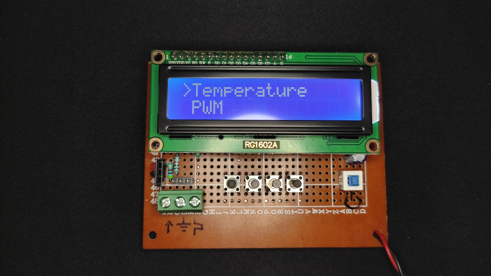

# TPFR_Meter


This is an ATmega328p based Temperature, PWM generator, Frequency counter and RPM meter. 
# BACK STORY
Often when creating circuits involving MOSFETs or motor drivers, I happen to find a need for a temperature sensor to measure the temperatures of my MOSFETs, a PWM generator to control the speed of motors or to test servos. Not only did have a need for a PWM generator but also a frequency counter when tinkering around with ne555 cicuits based oscillator circuits. Designing separate circuits to fullfill each of my needs would prove to time consuming, expensive and would require additional space to store all the devices. Thus, the idea of creating all purpose meter to measure temperature, generate PWM signals, measure Frequency and RPM struck me which resulted in me creating this multi purpose meter called the TPFR meter. 

# What does TPFR mean?
Well TPFR stands for Temperature(T), PWM(P), Frequency(F) and RPM(R) which is representative of the functionality of this meter.

# FEATURES: 
## 1. TEMPERATURE


The temperature measurement is done with the help of a ds18b20 waterproof temperature sensor with a max measurable temperature of 125 degree celsius and a minimum of -55 degree celsius.

## 2. PWM


The PWM signals are generated using the timer1 of the 328p with a frequency range of 31Hz - 100KHz and a variable duty cycle from 0 - 100%.
The frequency range is subdivied into 4 ranges:

| Range | Frequency Range |
| :---: | :---: |
| 1 | 31Hz - 1KHz |
| 2 | 1KHz - 10KHz |
| 3 | 10KHz - 40KHz |
| 4 | 40KHz - 100KHz |

## 3. FREQUENCY COUNTER


The frequency counter mode as the name implies measures the frequency of the input signal with an accuracy of 99.8%. The error% is usually around 0.02% - 0.01%. The maximum error% that I recorded was 0.2%. I do not know the maximum measurable frequency since my test setup could only reach a maximum frequency of 100Khz.

## 4. RPM


This mode uses the timer1's input capture register to measure the period of the input signal and then computes the revolution per minute(RPM) and the revolution per second(RPS). The maximum measurable RPM is in the vicinity of 100,000 RPM(approx). Unfortunately, I do not have the equipment to measure the actual maximum RPM.

 ### Measuring RPM:
 1. To measure the RPM, an [IR proximity sensor](https://hackster.imgix.net/uploads/attachments/471152/obstacle-avoidance-tracking-infrared-sensor-module_S9CxCA7UqZ.jpg?auto=compress&w=900&h=675&fit=min&fm=jpg) is used.
 2. The RPM of the object to measured, a wheel in my case, is covered by a black tape with a white spot on it. The white spot is needed to reflect the IR light which in turn triggers the output of the IR sensor.
 
 ### Note: 
 The output of the IR sensor must be pulled up to VCC using a pull up resistor of 4.7K or so. This is because the IR sensor has an open collector output ,i.e, the output can only be pulled LOW so a pull up resistor is needed to avoid a floating pin. Refer to the connection diagram below: 
 
# ELECTRICAL CHARACTERISTICS
 | Pin | Voltage |
 | :---: | :---: |
 | Input | 7.5V - 12V |
 | PWM | 5V |
 | Frequency Counter | 5V |
 | dsb18b20 data pin | 5V |

# USER INTERFACE: 
To use the this device, we must be aware of the hardware as well as the software interface and that is what we will be covering in this section starting with the pinout.

## PINOUT
 Seeing all those switches and connector might seem intimidating at first but don't you worry as that is what I will breaking down   to you in this section.
 
 
 
 Each connector and switch in the picture has been designated with a number to aid with it's identification in the table below:
 
 | Pin No | Function |
 | :----: | :------: |
 | 1 | 5V |
 | 2 | GND |
 | 3 | dsb18b20 data pin |
 | 4 | Frequency counter |
 | 5 | GND |
 | 6 | PWM |
 | 7 | BACK |
 | 8 | UP / Increament |
 | 9 | DOWN / Decreament |
 | 10 | ENTER / SELECT |
 | 11 | Power switch |
 
 ## HOW TO USE:
- Connect a 9v battery and press the power button. 
- On startup you will be greated with the homescreen/menupage.  
- The cursor on the right points to the current selected the option. 
- Use the ```UP``` and ```DOWN``` buttons to navigate through the menu.
- Press the ```ENTER``` button to enter the menu or option.
- Press the ```BACK``` button to exit from the current option.

That's the basic on how to use the meter. However taking a look at an example will provide a broader picture.
Let's take the example of the PWM mode:
- Press the ```DOWN``` switch to point the arrow at the ```PWM``` mode.
- Press ```ENTER``` to enter PWM mode.
- Now, you will be greated with PWM frequency range menu. The PWM frequency range is subdivied into 4 ranges:

   | Range | Frequency Range |
   | :---: | :---: |
   | 1 | 31Hz - 1KHz |
   | 2 | 1KHz - 10KHz |
   | 3 | 10KHz - 40KHz |
   | 4 | 40KHz - 100KHz |
   
- Let's select the first range(31HZ - 1KHz) by pressing ```ENTER```.
- Now you will be presented with 2 options and those are frequency(```Freq:```) and  duty cycle (```Duty%:```). By default the frequency is set to the lowest value in the given range(31Hz in this case) while the duty cycle is set to to 50.
- To change the default value, the frequency value in this case, press ```ENTER```.
- Now the cursor moves to the right hand side, this implies that you are in the value edit mode.
- Press the ```UP``` or ```DOWN``` button to either increment or decreament the values in single steps or long press the respective button to rapidly increase or decrease the value.
- Once you have set the desired value, press ```ENTER``` to save it and the cursor moves back to the left hand side.
- The same steps are applicable for changing the duty cycle value.
- First, press the ```DOWN``` button to select duty cycle.
- Now press ```ENTER``` to select it and the cursor moves to the right hand side implying you are in the value edit mode.
- Now change the value by pressing the ```UP``` and ```DOWN``` buttons. The procedure is the same as shown above.
- Press ```ENTER``` to save the value.
### Note: 
- The frequency and duty cycle change only upon pressing ```ENTER```.
- The frequency increment step is not 1Hz for every range. It changes with the frequency range. The table below shows the shows the frequecny range and it's increament/decreament step value:

| | Frequency Range | Step Value |
| :---: | :---: | :---: |
| 1 | 31Hz - 1KHz | 1Hz |
| 2 | 1KHz - 10KHz | 10Hz |
| 3 | 10KHz - 40KHz | 100Hz |
| 4 | 40KHz - 100KHz | 1000Hz |

